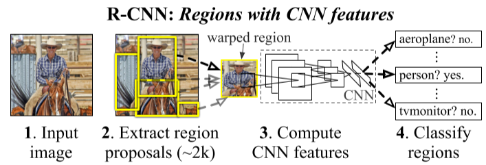
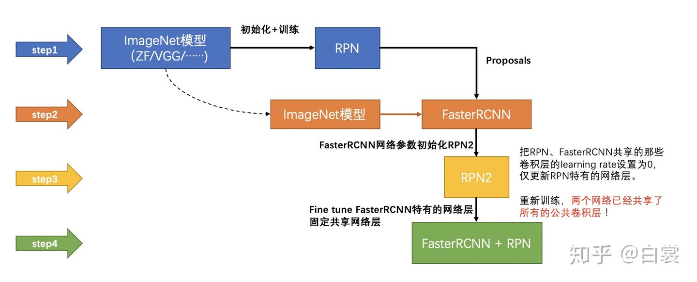

# Faster R-CNN 笔记

## Faster RCNN网络结构

Faster RCNN网络结构如下：


1. 经过卷积层进行特征提取获得**feature maps**
2. 通过Region Proposal Network获得**proposals**
3. 利用proposals将feature maps中指定区域进行**pooling**
4. 进行**分类**

## 特征提取

在RCNN中是先找到region proposals后对兴趣区进行特征提取然后进行分类，简单讲就是先找到region proposals后将每一个region proposals喂入CNN进行分类。示意图如下：



但是从上面明显可以看出，每一个region proposal会有重叠，这时CNN会对input image中区域进行重复计算，所以在 faster rcnn 中修改了步骤，先进行特征提取，然后再进行region proposals的提取和检测分类。

在[faster_rcnn_vgg16.py](model/faster_rcnn_vgg16.py#26)中使用预训练的VGG16作为特征提取器，代码如下（有省略）：

```python
def decom_vgg16():
    # the 30th layer of features is relu of conv5_3
    ......
    model = vgg16(not opt.load_path)
    
    features = list(model.features)[:30]
    classifier = model.classifier
    ......

    # freeze top4 conv
    for layer in features[:10]:
        for p in layer.parameters():
            p.requires_grad = False

    return nn.Sequential(*features), classifier
```

## Region Proposal Network

在 rcnn 和 fast rcnn中使用 selective search 来获得region proposals。因为这是一种手工设定特征然后获取的方式，所以在faster rcnn使用神经网络 Region Proposal Network 来获得 region proposals。

Region Proposal Network结构图如下：


对应上图，[Region Proposal Network部分代码](model/region_proposal_network.py#L77)如下：（为方便表示上图结构，有删减）

```Python
class RegionProposalNetwork(nn.Module):

    def __init__(self, ......):
        ......
        self.conv1 = nn.Conv2d(in_channels, mid_channels, 3, 1, 1)
        # n_anchor * 2中的2：bounding box是foreground 还是 background
        self.score = nn.Conv2d(mid_channels, n_anchor * 2, 1, 1, 0)
        # n_anchor * 4中的4：bounding box的四个位置信息
        self.loc = nn.Conv2d(mid_channels, n_anchor * 4, 1, 1, 0)
        ......

    def forward(self, x, img_size, scale=1):
        
        n, _, hh, ww = x.shape
        anchor = _enumerate_shifted_anchor(np.array(self.anchor_base),
                                           self.feat_stride, hh, ww)
        
        n_anchor = anchor.shape[0] // (hh * ww)
        # 3x3卷积
        h = F.relu(self.conv1(x))

        """   bounding box位置信息   """
        # 1x1卷积
        rpn_locs = self.loc(h)
        rpn_locs = rpn_locs.permute(0, 2, 3, 1).contiguous().view(n, -1, 4)
        # 最终获得为对 anchor 的平移距离（dx，dy）和缩放比例（dh，dw）

        """   bounding box分类信息   """
        # 1x1卷积
        rpn_scores = self.score(h)
        rpn_scores = rpn_scores.permute(0, 2, 3, 1).contiguous()
        # softmax
        rpn_softmax_scores = F.softmax(rpn_scores.view(n, hh, ww, n_anchor, 2), dim=4)
        rpn_fg_scores = rpn_softmax_scores[:, :, :, :, 1].contiguous()
        rpn_fg_scores = rpn_fg_scores.view(n, -1)
        rpn_scores = rpn_scores.view(n, -1, 2)

        """   获得相应的ROI(region of interest)   """
        rois = list()
        roi_indices = list()
        for i in range(n):
            # 将 anchor 转换为img上的bounding box
            roi = self.proposal_layer(rpn_locs[i].cpu().data.numpy(),
                                      rpn_fg_scores[i].cpu().data.numpy(),
                                      anchor, img_size,scale)
            batch_index = i * np.ones((len(roi),), dtype=np.int32)
            rois.append(roi)
            roi_indices.append(batch_index)

        rois = np.concatenate(rois, axis=0)
        roi_indices = np.concatenate(roi_indices, axis=0)
        return rpn_locs, rpn_scores, rois, roi_indices, anchor
```

这里有几个需要注意的细节：
1. **anchor**：上面代码中anchor的使用为:[RegionProposalNetwork](model/region_proposal_network.py#L176)$\rightarrow$[ProposalCreator](model/utils/creator_tool.py#368)$\rightarrow$[loc2bbox](model/utils/bbox_tools.py#L7)，可以将其理解为bounding box的先验长宽比
2. **nms**：在`self.proposal_layer()`中使用NMS（non-maximum suppression）去除重叠bounding box中的冗余box（RCNN中引入）
3. **loss func**：RPN的损失函数和fast rcnn部分很像，包括两部分：classification( $log loss$ )和regression( $smooth L1$ )，代码见[trainer.py](trainer.py#L123)
4. bouuding box regression中的坐标如下：($x$、$x_a$和$x^*$分别为预测框、anchor和ground-truth box)
    


## ROI Pooling

在RCNN中为了将不同大小的region proposals放入CNN中进行目标检测，将不同大小的region proposals缩放为相同尺寸的img才输入CNN中，但是这样的缺点就是可能会丢失大量的细节。

于是在Spatial Pyramid Pooling in Deep Convolutional Networks for Visual Recognition中引入了Spatial Pyramid Pooling，后在faste rcnn中简化为ROI Pooling。

ROI Pooling的目标是将不同尺寸的input pooling为相同尺寸的output，因此这里动态调整pooling的size
和stride使得最终的output尺寸相同。

此处代码可见：[VGG16RoIHead](model/faster_rcnn_vgg16.py#L79)

## Fast RCNN

之后便和Fast RCNN相同（其实ROI Pooling部分也相同）：


这一部分和RPN很类似，[代码](model/faster_rcnn_vgg16.py#L53)如下：（有删减）
```Python
class VGG16RoIHead(nn.Module):

    def __init__(self, n_class, roi_size, spatial_scale, classifier):
        ......
        # 分类器来自VGG16的classifier部分
        self.classifier = classifier
        self.cls_loc = nn.Linear(4096, n_class * 4)
        self.score = nn.Linear(4096, n_class)
        ......
        self.roi = RoIPool((self.roi_size, self.roi_size), self.spatial_scale)

    def forward(self, x, rois, roi_indices):
        ......
        pool = self.roi(x, indices_and_rois)
        ......
        fc7 = self.classifier(pool)
        roi_cls_locs = self.cls_loc(fc7)
        roi_scores = self.score(fc7)
        return roi_cls_locs, roi_scores
```

之后的[损失函数部分](trainer.py#L143)和RPN部分也很相似。

## 网络结构总结

总体的网络结构如下：


## 网络训练

虽然论文中提到可以将Faster RCNN可以融合作为一个网络进行训练，但是作者在实际训练中并没有这样做。实际训练过程为：
1. 使用预训练模型**训练RPN**
2. 使用预训练模型**训练Fast RCNN**，PRN为上一步的RPN且**RPN不参与训练**
3. 在第二步基础上**训练RPN**，固定卷积层
4. **微调Fast RCNN**，固定卷积层

结果展示如下：
